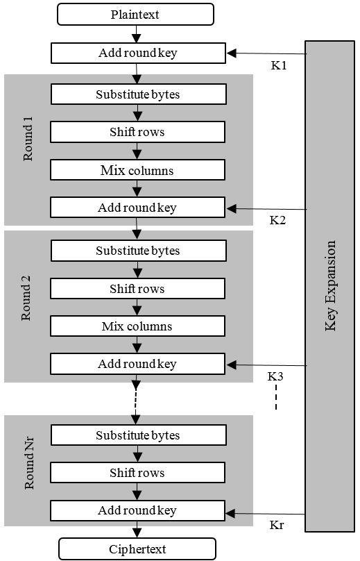
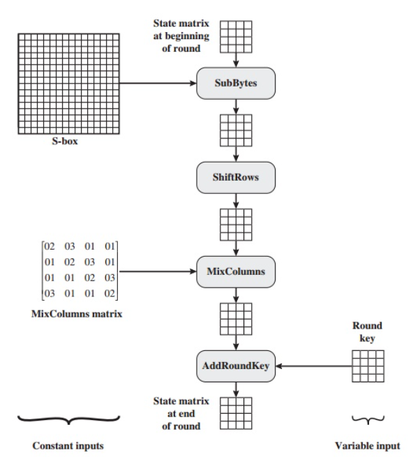
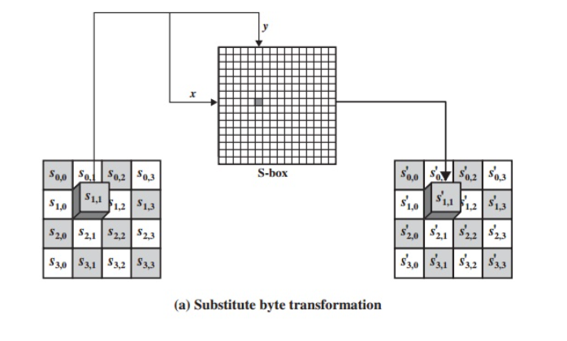
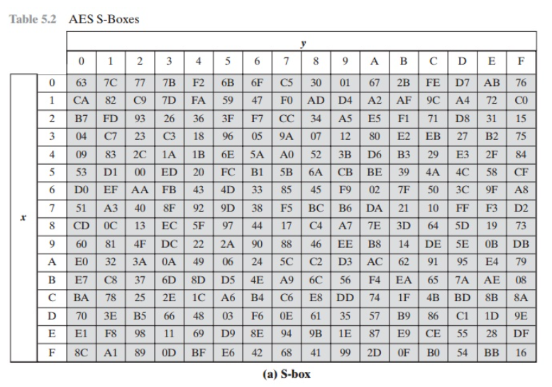
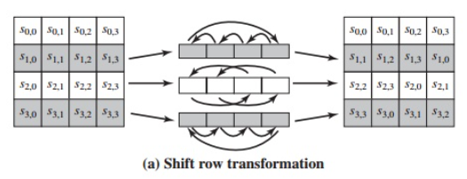
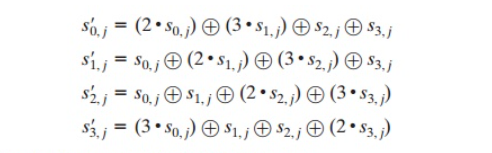
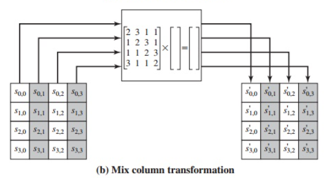
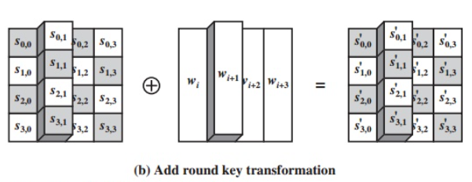
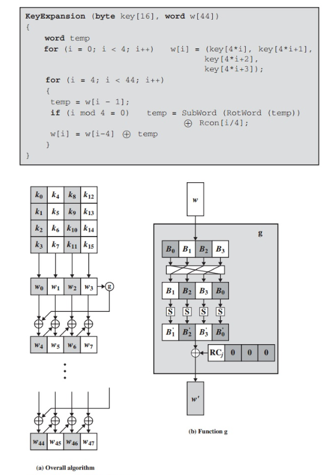
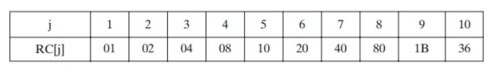

# AES

## Advanced Encryption Standard (AES) modelling, using Verilog HDL.

### Introduction

Implementation of the 128-bit AES protocol, is a specification for the encryption of electronic data established by the U.S National Institute of Standards and Technology (NIST) in 2001. AES is widely used today as it is a much stronger than DES and triple DES despite being harder to implement.

*   ***Points to remember***

    *   AES is a block cipher.
    *   The key size can be 128/192/256 bits.
    *   Encrypts data in blocks of 128 bits each.

That means it takes 128 bits as input and outputs 128 bits of encrypted cipher text as output. AES relies on substitution-permutation network principle which means it is performed using a series of linked operations which involves replacing and shuffling of the input data.

*   ***Working of the cipher :***

AES performs operations on bytes of data rather than in bits. Since the block size is 128 bits, the cipher processes 128 bits (or 16 bytes) of the input data at a time.

*   ***The number of rounds depends on the key length as follows :***

    *   128 bit key – 10 rounds
    *   192 bit key – 12 rounds
    *   256 bit key – 14 rounds

*   *For more information about AES, check [AES (step-by-step)](https://www.cryptool.org/en/cto/aes-step-by-step).*

**Table of contents**

-   [Encryption Top Module][Top]
-   [Rounds][Rounds]
    -   [Substitute Bytes][sub]
    -   [Shift Rows][shift]
    -   [Mix Coloumns][mix]
    -   [Add Round Key][ark]
-   [Key Expansion][Key]

[mix]: #mix-coloumns
[ark]: #add-round-key
[shift]: #shift-rows
[sub]: #substitute-bytes
[Key]: #key-expansion
[Rounds]: #rounds
[Top]: #encryption-top-module

### Encryption Top Module

As illustrated in the figure below:

The protocol starts by taking the *Plain Text* input consisting of 128-bits, initially adds the input key, then starts the rounds, in each it goes through four steps.

1. Substitute Bytes.
2. Shift Rows.
3. Mix Coloumns.
4. Add Round Key.

*   *Except the last round, it doesn't have the Mix Coloumns Stage.*

### Rounds

#### Substitute Bytes

It is called *SubBytes*, is a  simple table lookup. AES defines a 16 * 16 matrix of byte values, called an *S-box*, that contains a permutation of all possible 256 8-bit values. Each individual byte of State is mapped into a new byte in the following way: The leftmost 4 bits of the byte are used as a row value and the rightmost 4 bits are used as a column value. These row and column values serve as indexes into the *S-box* to select a unique 8-bit output value.

#### Shift Rows

It is called *ShiftRows*, The first row of State is not altered. For the second row, a 1-byte circular left shift is performed. For the third row, a 2-byte circular left shift is performed. For the fourth row, a 3-byte circular left shift is performed.

#### Mix Coloumns

It is called *MixColumns*, operates on each column individually. Each byte of a column is mapped into a new value that is a function of all four bytes in that column, The *MixColumns* transformation on a single column of State can be expressed as:

*   In this proposed work, common sub-expressions of *MixColumn* transformation has been identified and eliminated to further reduce the hardware complexity of AES Encryption, by utilizing the common resources to all numerical calculation of 
MixColumn transformation.

#### Add Round Key

It is called *AddRoundKey*, the 128 bits of State are bitwise XORed with the  128 bits of the round key. As shown in Figure 5.5b, the operation is viewed as a columnwise operation between the 4 bytes of a State column and one word of the round key; it can also be viewed as a byte-level operation.

### Key Expansion

The AES key expansion algorithm takes as input a four-word (16-byte) key and produces a linear array of 44 words (176 bytes). This is sufficient to provide a four-word round key for the initial AddRoundKey stage and each of the 10 rounds of the cipher. The pseudocode on the next page describes the expansion.

The key is copied into the first four words of the expanded key. The remain- der of the expanded key is filled in four words at a time. Each added word w[i] depends on the immediately preceding word, w[i  - 1], and the word four posi-  tions back, w[i - 4]. In three out of four cases, a simple XOR is used. For a word whose position in the w array is a multiple of 4, a more complex function is used. Figure 5.9 illustrates the generation of the expanded key, using the symbol g to represent that complex function. The function g consists of the following subfunctions.

1. RotWord performs a one-byte circular left shift on a word. This means that an input word [B0, B1, B2, B3] is transformed into [B1, B2, B3, B0].
2. SubWord performs a byte substitution on each byte of its input word, using the S-box (Table 5.2a).
3. The result of steps 1 and 2 is XORed with a round constant, Rcon[j].

The round constant is a word in which the three rightmost bytes are always 0. Thus, the effect of an XOR of a word with Rcon is to only perform an XOR on the left- most byte of the word. The round constant is different for each round and is defined as Rcon[j] = (RC[j], 0, 0, 0), with RC[1] = 1, RC[j] = 2 RC[j -1] and with multiplica- tion defined over the field GF(28). The values of RC[j] in hexadecimal are:

